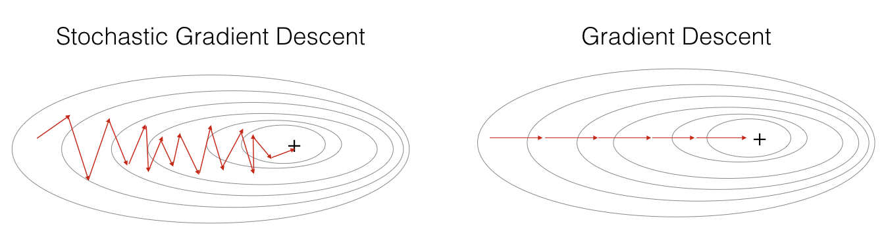
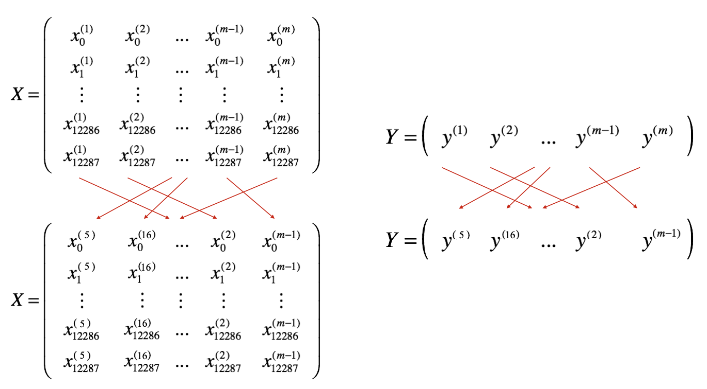
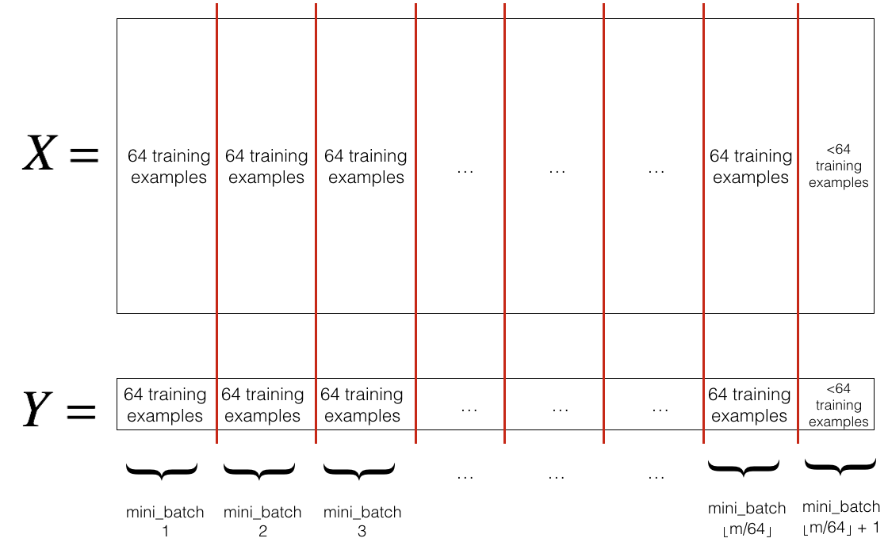
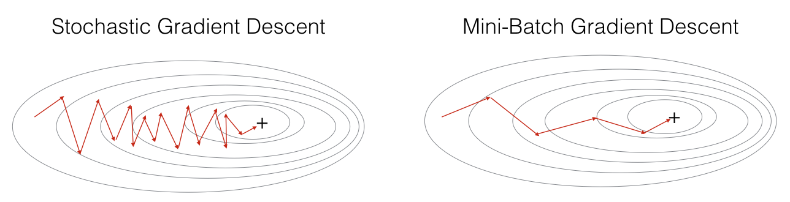
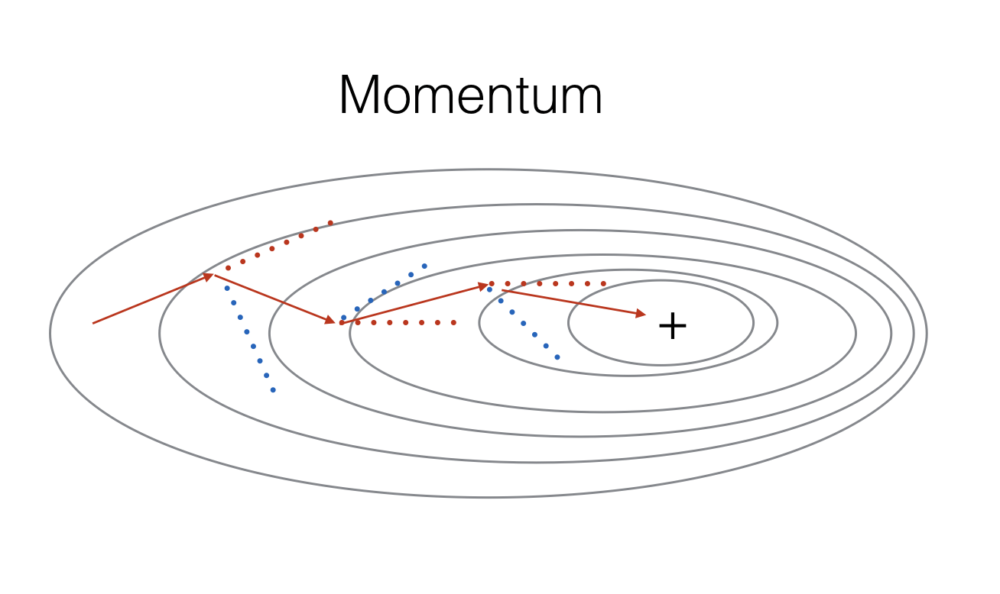
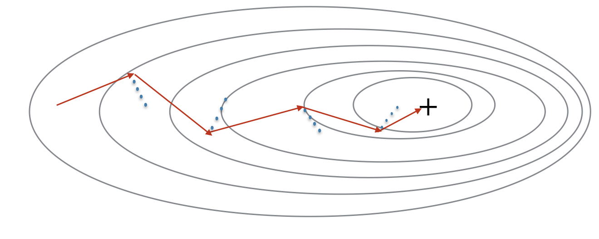
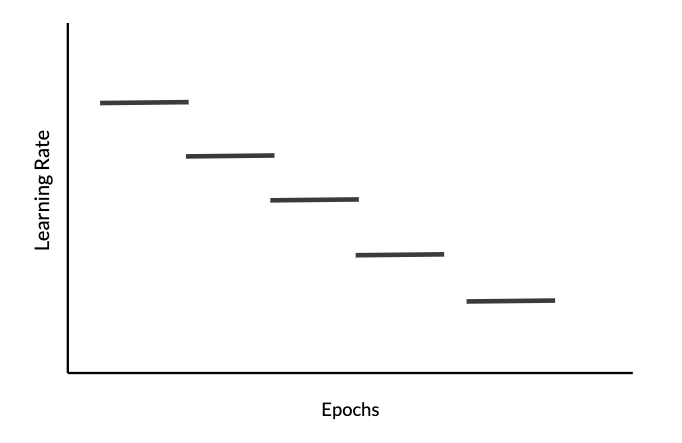
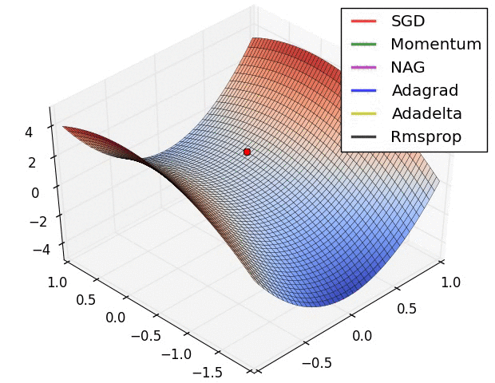

# Optimization Methods for Deep Neural Networks

A practical implementation and comparative study of optimization techniques used to train deep neural networks efficiently.

This project explores how different optimization algorithms influence convergence speed, optimization stability, and model performance through hands-on implementations, mathematical intuition, and visual demonstrations. The notebook implements Mini-Batch Gradient Descent, Momentum, Adam, and Learning Rate Decay while explaining the role of RMSProp within the Adam optimization algorithm.

---

## Project Overview

Optimization is one of the most important components of deep learning. Although neural network architectures define the model, optimization algorithms determine how efficiently the network learns from data.

This project investigates several widely used optimization techniques introduced in modern deep learning and demonstrates how they improve training compared with standard Gradient Descent.

The notebook combines theoretical explanations with practical implementations and visualizations to illustrate how each optimization method affects parameter updates and convergence.

---

## Features

- Implementation of Mini-Batch Gradient Descent
- Random data shuffling before each training epoch
- Mini-batch generation and partitioning
- Momentum optimization
- Adam optimizer implementation
- Learning Rate Decay scheduling
- Cost function visualization during training
- Decision boundary visualization
- Comparison of optimization algorithms
- Classification accuracy evaluation
- Practical demonstrations of optimization trajectories
- Mathematical intuition behind Momentum, RMSProp, and Adam

---

## Optimization Methods Covered

### Gradient Descent

Updates model parameters using gradients computed from the entire training dataset. While stable, this approach becomes computationally expensive for large datasets.

<p align="center">

</p>

---

### Mini-Batch Gradient Descent

Instead of processing the complete dataset at once, the training set is randomly shuffled and divided into small batches. Each mini-batch performs one forward pass, one backward pass, and one parameter update.

This approach provides an effective balance between computational efficiency and optimization stability.

<p align="center">

</p>

<p align="center">

</p>

<p align="center">

</p>

---

### Momentum

Momentum accelerates optimization by maintaining an exponentially weighted average of previous gradients.

Instead of relying only on the current gradient, Momentum preserves information from previous updates, reducing oscillations and improving convergence along consistent optimization directions.

<p align="center">

</p>

<p align="center">

</p>

---

### RMSProp

RMSProp (Root Mean Square Propagation) adapts the learning rate individually for each parameter by maintaining an exponentially weighted average of squared gradients.

Unlike Momentum, which improves the optimization direction, RMSProp adjusts the magnitude of parameter updates. Large gradients produce smaller updates, while small gradients allow relatively larger updates, resulting in smoother optimization.

Although RMSProp is discussed conceptually in this project, it is incorporated through the Adam optimizer rather than implemented as a standalone optimization algorithm.

---

### Adam (Adaptive Moment Estimation)

Adam combines the strengths of Momentum and RMSProp.

It simultaneously maintains:

- First-order moment estimates (Momentum)
- Second-order moment estimates (RMSProp)

Bias correction is then applied before updating the parameters, producing fast, stable, and adaptive optimization. Adam has become one of the most widely used optimization algorithms for deep learning.

---

### Learning Rate Decay

Learning Rate Decay gradually decreases the learning rate throughout training.

Large learning rates enable rapid progress during the early stages of optimization, while smaller learning rates later in training allow the optimizer to perform finer parameter adjustments and improve convergence.

<p align="center">

</p>

---

## Optimization Comparison

The notebook compares different optimization strategies and illustrates how each optimizer follows a different trajectory toward the minimum of the cost function.

<p align="center">

</p>

<p align="center">

</p>

---

## Experimental Results

The implemented optimization methods are evaluated using:

- Cost convergence
- Decision boundary visualization
- Classification accuracy
- Optimization trajectory comparison

The experiments demonstrate how advanced optimization techniques such as Momentum and Adam improve convergence behavior compared with standard Gradient Descent while maintaining high predictive performance.

---

## Repository Structure

```text
Optimization-Methods/
│
├── Optimization_methods.ipynb
├── datasets/
├── images/
├── opt_utils_v1a.py
├── README.md
├── .gitignore
└── requirements.txt
```

---

## Technologies

- Python
- NumPy
- Matplotlib
- Jupyter Notebook

---

## How to Run

1. Clone the repository.

```bash
git clone https://github.com/<your-username>/Optimization-Methods.git
```

2. Navigate to the project directory.

```bash
cd Optimization-Methods
```

3. Launch Jupyter Notebook.

```bash
jupyter notebook
```

4. Open **Optimization_methods.ipynb** and execute the notebook from top to bottom.

---

## Learning Outcomes

This project strengthened my understanding of:

- Gradient-based optimization
- Mini-Batch Gradient Descent
- Random shuffling and batch generation
- Momentum optimization
- RMSProp intuition
- Adam optimization
- Learning Rate Decay
- Neural network training workflows
- Optimization visualization and analysis

---

## Acknowledgements

This project was completed as part of the **Deep Learning Specialization** offered by **DeepLearning.AI**. The implementations were developed for educational purposes to better understand optimization algorithms used in modern deep learning.
