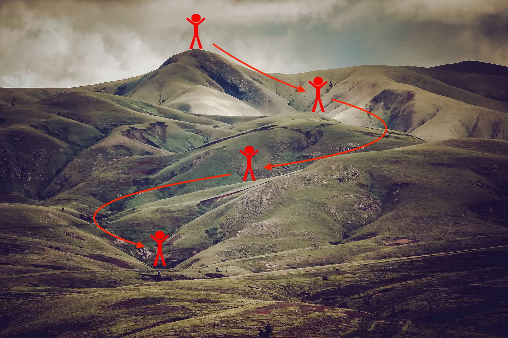

# Optimization Methods for Deep Neural Networks

A hands-on implementation of optimization techniques for training deep neural networks, completed as part of the Deep Learning Specialization.

This project demonstrates how different optimization algorithms affect convergence speed, learning stability, and final model performance. The notebook implements mini-batch gradient descent, Momentum, RMSProp concepts, Adam optimization, and learning rate decay while visualizing their behavior during training.

---

## Project Overview

Training neural networks efficiently requires more than standard Gradient Descent. This project explores modern optimization techniques that improve convergence by:

- Reducing oscillations
- Accelerating optimization
- Adapting learning rates
- Improving training stability
- Achieving faster convergence

The notebook compares optimization algorithms both mathematically and visually.

---

## Features

- Gradient Descent implementation
- Mini-Batch Gradient Descent
- Random mini-batch generation
- Momentum optimization
- Adam optimizer
- Learning rate decay
- Performance comparison between optimizers
- Cost visualization during training
- Decision boundary visualization
- Training accuracy evaluation

---

## Project Structure

```
Optimization-Methods/
│
├── Optimization_methods.ipynb
├── datasets/
├── images/
├── opt_utils_v1a.py
├── public_tests.py
├── testCases.py
└── README.md
```

---

# Optimization Techniques

## 1. Gradient Descent

Gradient Descent updates model parameters using the gradient computed from the entire training dataset.

### Advantages

- Stable updates
- Smooth convergence
- Easy to understand

### Limitations

- Slow on large datasets
- High computational cost

<p align="center">

</p>

---

## 2. Mini-Batch Gradient Descent

Instead of processing the entire dataset, the data is divided into small batches.

Each batch performs:

1. Forward propagation
2. Cost computation
3. Backpropagation
4. Parameter update

<p align="center">

</p>

Random shuffling is performed before every epoch.

<p align="center">

</p>

Mini-batch optimization provides a balance between computational efficiency and convergence stability.

<p align="center">

</p>

---

## 3. Momentum

Momentum accelerates Gradient Descent by accumulating gradients from previous updates.

Instead of following only the current gradient, Momentum uses a velocity term that helps move consistently toward the optimum while reducing oscillations.

<p align="center">

</p>

Visualization of the optimization trajectory:

<p align="center">

</p>

---

## 4. Learning Rate Decay

Rather than using a fixed learning rate, the learning rate gradually decreases during training.

Benefits include:

- Large updates at the beginning
- Small refinements near convergence
- Reduced overshooting
- Improved stability

<p align="center">

</p>

---

## 5. Adam Optimization

Adam combines:

- Momentum (first moment)
- Adaptive learning rates (second moment)

This allows each parameter to have its own effective learning rate while maintaining optimization direction.

Adam generally converges faster and more reliably than vanilla Gradient Descent.

---

# Optimization Comparison

Different optimization algorithms follow different paths toward the minimum.

<p align="center">

</p>

Another optimization landscape comparison:

<p align="center">

</p>

---

# Cost Landscape

The optimization objective can be viewed as navigating a complex cost surface toward the global or local minimum.

<p align="center">

</p>

---

# Results

The notebook compares optimization methods based on:

- Training accuracy
- Cost reduction
- Decision boundaries
- Convergence speed
- Learning stability

Experiments demonstrate that advanced optimizers such as Momentum and Adam significantly improve optimization efficiency compared with standard Gradient Descent.

---

# Technologies Used

- Python
- NumPy
- Matplotlib
- Jupyter Notebook

---

# Learning Outcomes

Through this project, I gained practical experience with:

- Gradient-based optimization
- Mini-batch training
- Momentum optimization
- Adam optimizer
- Learning rate scheduling
- Hyperparameter tuning
- Neural network training workflows
- Cost function visualization

---

# References

- Deep Learning Specialization — Andrew Ng
- DeepLearning.AI
